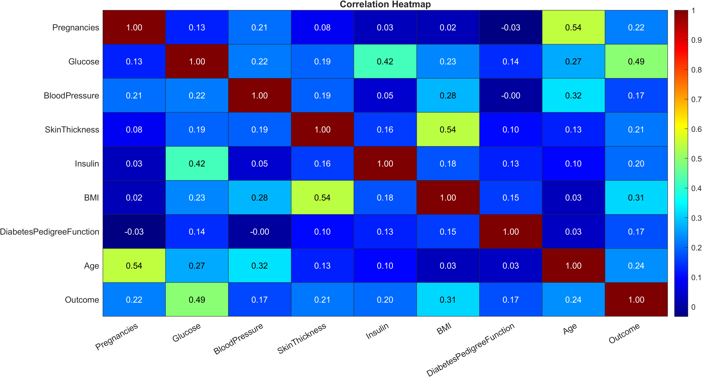
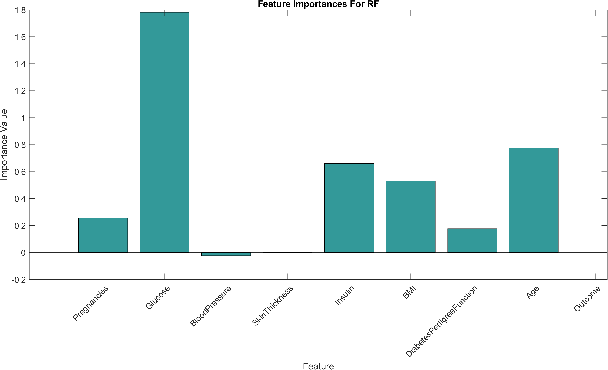
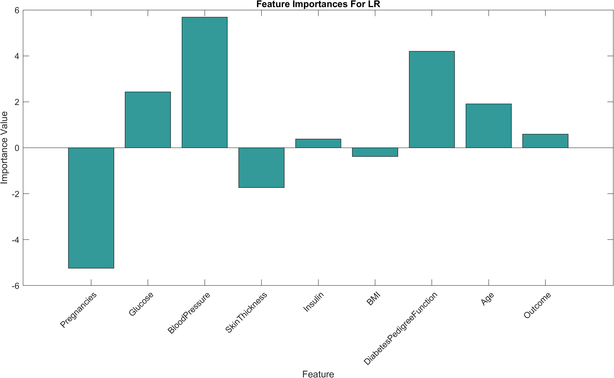
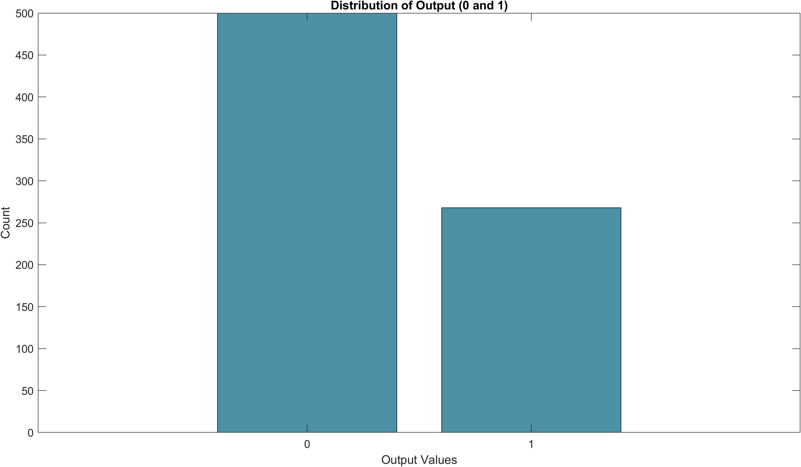
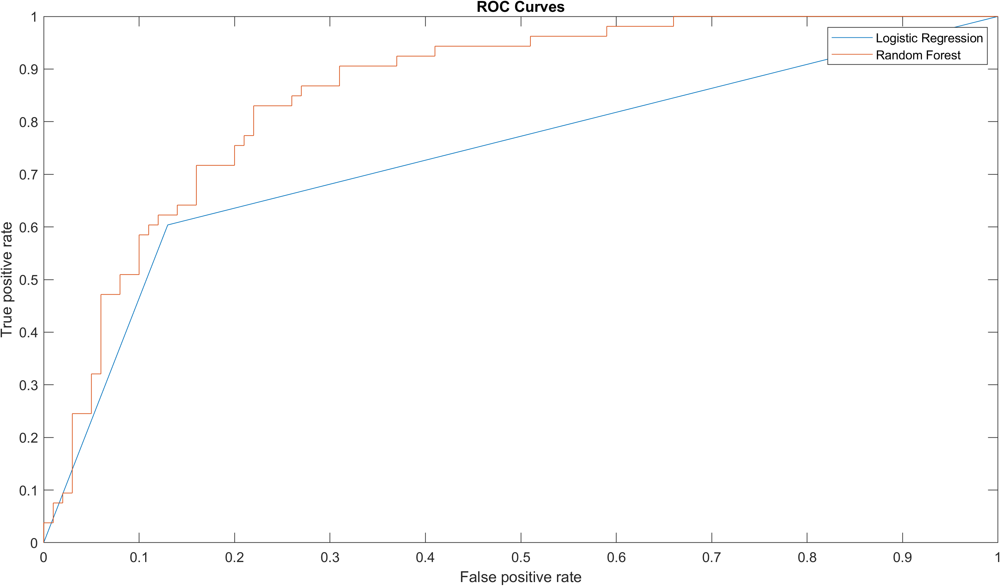

# Diabetes Prediction: Comparing Random Forest & Logistic Regression

## 📌 Project Overview
This project compares the performance of **Random Forest (RF)** and **Logistic Regression (LR)** on the Pima Indians Diabetes Dataset to predict the presence of diabetes in women aged 21+ of Pima Indian heritage. The goal is to evaluate model accuracy, computational efficiency, and robustness in handling imbalanced data. Results are benchmarked against the study by *Chang et al. (2022)*.

### Key Questions Addressed:
- Which model (RF or LR) performs better in terms of accuracy, AUC, and computational speed?
- How do feature importance and correlation impact predictions?
- Does hyperparameter tuning significantly improve performance?

---

## 🏥 Dataset Details
- **Source**: [Kaggle](https://www.kaggle.com/datasets/uciml/pima-indians-diabetes-database)
- **Samples**: 768 women (8 predictors, 1 binary target)
- **Features**: Pregnancies, Glucose, Blood Pressure, Skin Thickness, Insulin, BMI, Diabetes Pedigree Function, Age
- **Preprocessing**:
  - Replaced missing values (encoded as `0`) with mean/median.
  - Normalized predictors using min-max scaling.
  - Split into 60:20:20 (train/validation/test).

---

## 🛠️ Methodology
1. **Data Cleaning & EDA**:
   - Handled missing values (mean for Glucose/BP, median for Skin Thickness/Insulin/BMI).
   - Analyzed correlations (e.g., Glucose and BMI strongly linked to diabetes).
2. **Model Training**:
   - **Random Forest**: Hyperparameter tuning (trees=150, max splits=40, leaf size=30) via 10-fold CV.
   - **Logistic Regression**: Grid search for lambda (best=0.001).
3. **Evaluation Metrics**:
   - Accuracy, AUC, Precision, Recall, F1-Score.

---

## 📊 Results
### Model Performance Comparison (Test Set)
| Metric               | Random Forest | Logistic Regression |
|----------------------|---------------|---------------------|
| **Accuracy**         | 78%           | 77%                 |
| **AUC**              | 0.82          | 0.75                |
| **Precision**        | 0.74          | 0.68                |
| **Recall**           | 0.65          | 0.72                |
| **F1-Score**         | 0.69          | 0.70                |
| **Training Speed**   | Slow          | Fast                |

### Key Findings:
- **RF Strengths**: Higher AUC (0.82), better precision.
- **LR Strengths**: Faster training, better recall.
- Both models struggled with class imbalance (more "no diabetes" predictions).
- RF overfits slightly on training data but generalizes well on test data.
- **Contradiction to Hypothesis**: RF had lower TP/FP rates than expected.

---

## 📸 Key Visualizations
### Figure 1: Frequency Distribution Before & After Imputation
  
*Dimensions: 1200x630*  
**Top**: Original dataset with missing values (encoded as 0).  
**Bottom**: After replacing missing values with mean/median.  

### Figure 2: Correlation Heatmap
  
*Dimensions: 1200x630*  
Glucose, BMI, and Age show strong positive correlations with diabetes.  

### Figure 3: Feature Importance (Random Forest vs. Logistic Regression)
  
*Dimensions: 1200x630*  
**RF**: Glucose and BMI are top predictors.  

  
*Dimensions: 1200x630*  
**LR**: Blood Pressure and Diabetes Pedigree Function dominate.  

### Figure 4: Class Distribution
  
*Dimensions: 1200x630*  
**Imbalanced dataset**: ~65% "No Diabetes" vs. ~35% "Diabetes".  

### Figure 5: ROC Curves
  
*Dimensions: 1200x630*  
**RF AUC = 0.82**: Better class separation.  
**LR AUC = 0.75**: Moderate performance.  

---

## 📹 Presentation Video  
- [Download the video here](video/vid_presentation)  
- *Optimized for social media sharing.*

---

## 📝 Lessons Learned & Future Work
### Lessons:
- **Feature Selection**: Critical for LR (e.g., excluding negatively correlated features improved accuracy).
- **Hyperparameter Tuning**: RF requires careful tuning (OOB error may outperform CV for small datasets).
- **Class Imbalance**: Addressing imbalance (e.g., SMOTE) could improve recall.

### Future Work:
- Experiment with feature engineering and advanced techniques (XGBoost, SVM).
- Compare OOB error vs. cross-validation for hyperparameter tuning.
- Expand dataset size and apply anomaly detection for outliers.

---

## 🔗 References
- [Chang, V., Bailey, J., Xu, Q.A. et al. Pima Indians diabetes mellitus classification based on machine learning (ML) algorithms. Neural Comput & Applic 35, 16157–16173 (2023). https://doi.org/10.1007/s00521-022-07049-z]
- Full references in [docs/presentation.pptx](docs/presentation.pptx)

---

### OpenGraph Meta Tags (Add to HTML Head)
```html
<meta property="og:title" content="Diabetes Prediction: Comparing Random Forest & Logistic Regression">
<meta property="og:description" content="A machine learning project comparing Random Forest and Logistic Regression for diabetes prediction using the Pima Indians Diabetes Dataset.">
<meta property="og:image" content="https://yourdomain.com/images/ROC_curve.png">
<meta property="og:url" content="https://yourdomain.com/project-overview">
<meta property="og:type" content="website">
<meta property="og:site_name" content="Diabetes Prediction Project">
<meta property="og:locale" content="en_US">
<meta property="twitter:card" content="summary_large_image">
<meta property="twitter:title" content="Diabetes Prediction: Comparing Random Forest & Logistic Regression">
<meta property="twitter:description" content="A machine learning project comparing Random Forest and Logistic Regression for diabetes prediction using the Pima Indians Diabetes Dataset.">
<meta property="twitter:image" content="https://yourdomain.com/images/ROC_curve.png">
